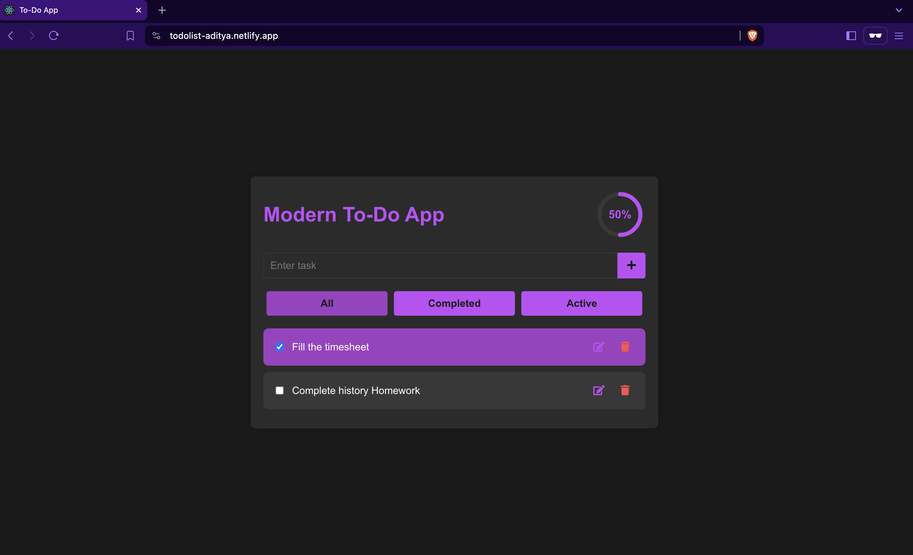
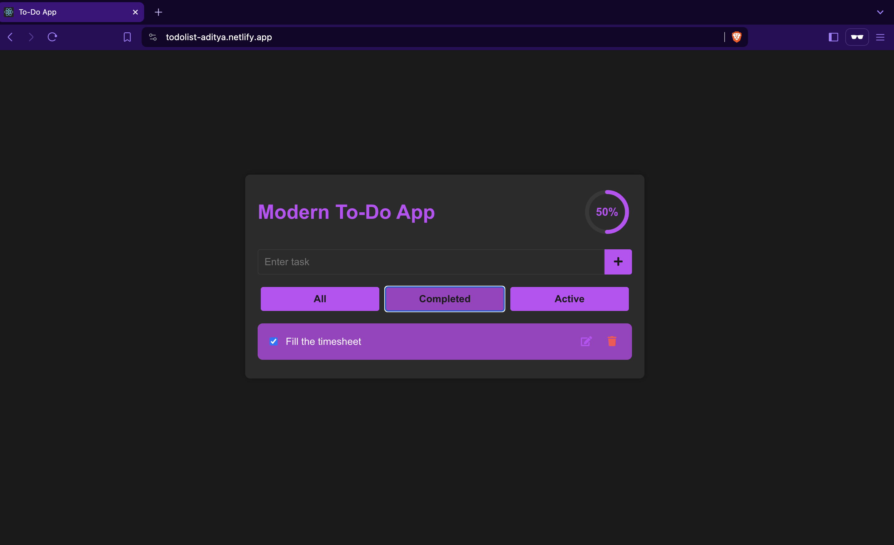
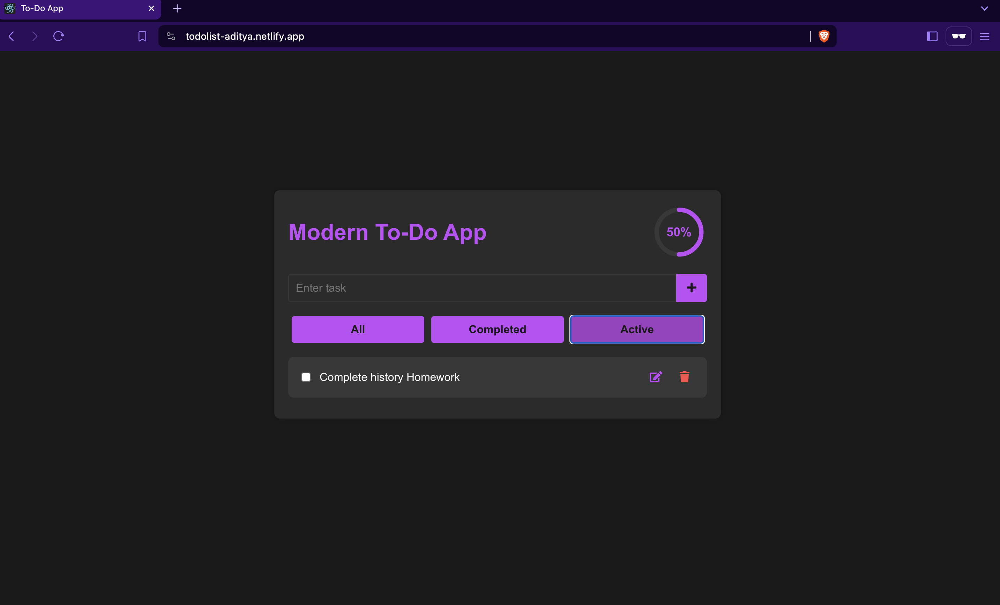

# Modern To-Do App

A modern and attractive To-Do application built using React.

## Description

This project is a simple To-Do application that allows users to add, edit, delete, and mark tasks as completed. It provides various features such as filtering tasks based on their completion status (all, completed, active). The user interface is designed to be attractive and modernistic, with a sidebar for filters and a main content area for displaying tasks as cards.

## Technologies Used

- React
- JavaScript
- HTML
- CSS

## Screenshots

### All Tasks 

### Completed Tasks

### Active Tasks


## Setup

1. **Clone the repository:**

   ```bash
   git clone https://github.com/adityas-github/todo-app.git
   ```

2. **Navigate to the project directory:**

   ```bash
   cd todo-app
   ```

3. **Install dependencies:**

   ```bash
   npm install
   ```

4. **Run the development server:**

   ```bash
   npm start
   ```

5. **Open [http://localhost:3000](http://localhost:3000) in your browser to view the app.**

## How to Use

1. **Add a Task**: Type the task you want to add in the input field at the top of the page and press the "Add" button.

2. **Edit a Task**: To edit a task, click on the task text. This will switch the task to edit mode, allowing you to modify the task's text. Once you're done editing, press the checkmark button to save the changes.

3. **Delete a Task**: To delete a task, click on the trash icon next to the task.

4. **Mark a Task as Completed**: To mark a task as completed, click on the checkbox next to the task. Clicking again will unmark the task.
   
5. **Enjoy Organizing Your Tasks!**

## Credits

This project was created by Aditya Mane as a part of Celebal Intership program.
